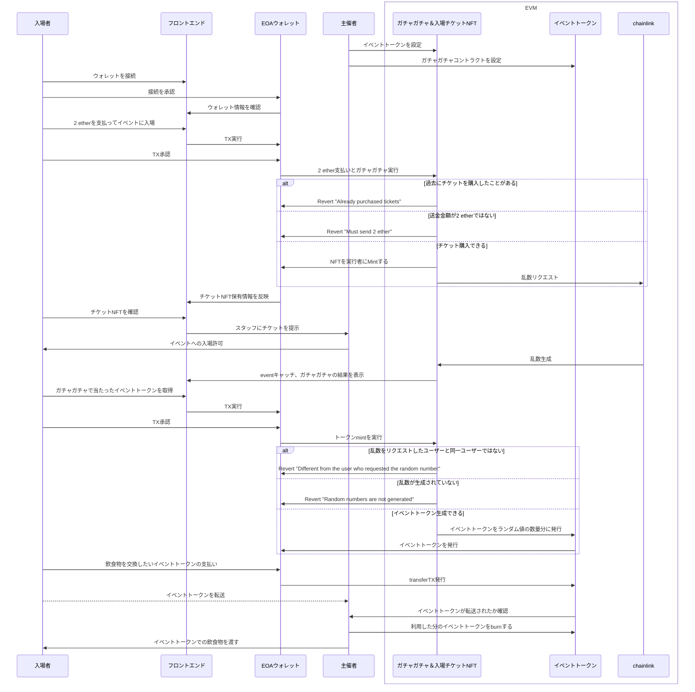

```mermaid
sequenceDiagram

participant P as 入場者
participant F as フロントエンド
participant EOA as EOAウォレット
participant U as 主催者
box EVM
  participant G as ガチャガチャ＆入場チケットNFT
  participant T as イベントトークン
  participant L as chainlink
end

U->>G: イベントトークンを設定
U->>T: ガチャガチャコントラクトを設定
P->>F: ウォレットを接続
P->>EOA: 接続を承認
EOA->>F: ウォレット情報を確認
P->>F: 2 etherを支払ってイベントに入場
F->>EOA: TX実行
P->>EOA: TX承認
EOA->>G: 2 ether支払いとガチャガチャ実行
alt 過去にチケットを購入したことがある
  G->>EOA: Revert "Already purchased tickets"
else 送金金額が2 etherではない
  G->>EOA: Revert "Must send 2 ether"
else チケット購入できる
  G->>EOA: NFTを実行者にMintする
  G->>L: 乱数リクエスト
end
EOA->>F: チケットNFT保有情報を反映
P->>F: チケットNFTを確認
F->>U: スタッフにチケットを提示
U->>P: イベントへの入場許可
L->>G: 乱数生成
G->>F: eventキャッチ、ガチャガチャの結果を表示
P->>F: ガチャガチャで当たったイベントトークンを取得
F->>EOA: TX実行
P->>EOA: TX承認
EOA->>G: トークンmintを実行
alt 乱数をリクエストしたユーザーと同一ユーザーではない
  G->>EOA: Revert "Different from the user who requested the random number"
else 乱数が生成されていない
  G->>EOA: Revert "Random numbers are not generated"
else イベントトークン生成できる
  G->>T: イベントトークンをランダム値の数量分に発行
  T->>EOA: イベントトークンを発行
end
P->>EOA: 飲食物を交換したいイベントトークンの支払い
EOA->>T: transferTX発行
P-->>U: イベントトークンを転送
T->>U: イベントトークンが転送されたか確認
U->>T: 利用した分のイベントトークンをburnする
U->>P: イベントトークンでの飲食物を渡す

```

