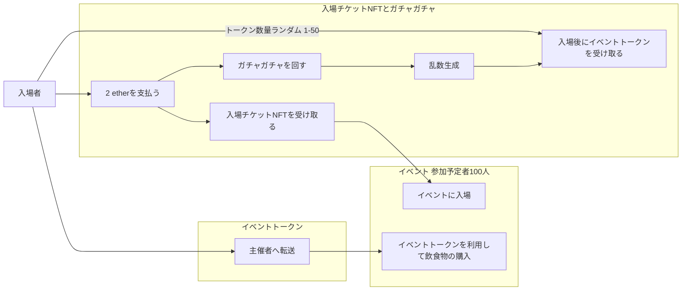
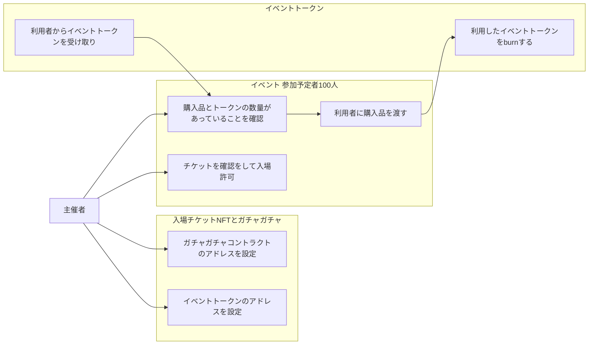

```mermaid
flowchart LR

P[入場者]

P --> C[2 etherを支払う]
C --> D[入場チケットNFTを受け取る]
D --> E[イベントに入場]
C --> F[ガチャガチャを回す]
F --> L[乱数生成]
L --> G[受け取り]
P --> |トークン数量ランダム 1-50| G[入場後にイベントトークンを受け取る]
P --> T[主催者へ転送]
T --> K[イベントトークンを利用して飲食物の購入]

subgraph イベント 参加予定者100人
  E
  K
end

subgraph 入場チケットNFTとガチャガチャ
  C
  D
  F
  L
  G
end

subgraph イベントトークン
  T
end


```

```mermaid

flowchart LR

U[主催者]
E[利用者からイベントトークンを受け取り]

U --> Z[イベントトークンのアドレスを設定]
U --> X[ガチャガチャコントラクトのアドレスを設定]
U --> H[チケットを確認をして入場許可]
U --> F[購入品とトークンの数量があっていることを確認]
E --> F
F --> G[利用者に購入品を渡す]
G --> J[利用したイベントトークンをburnする]

subgraph イベント 参加予定者100人
  H
  F
  G
end

subgraph 入場チケットNFTとガチャガチャ
  Z
  X
end

subgraph イベントトークン
  J
  E
end


```