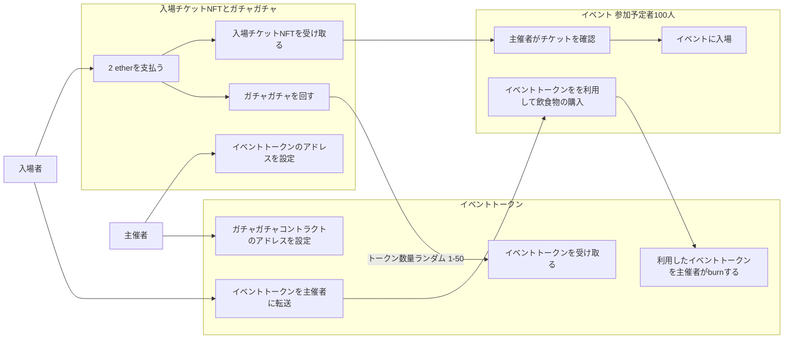

```mermaid
flowchart LR

U[主催者]
P[入場者]


U --> Z[イベントトークンのアドレスを設定]
U --> X[ガチャガチャコントラクトのアドレスを設定]
P --> C[2 etherを支払う]
C --> D[入場チケットNFTを受け取る]
D --> H[主催者がチケットを確認]
H --> E[イベントに入場]
C --> F[ガチャガチャを回す]
F --> |トークン数量ランダム 1-50| G[イベントトークンを受け取る]
K --> I[イベントトークンをを利用して飲食物の購入]
  --> J[利用したイベントトークンを主催者がburnする]
P --> K[イベントトークンを主催者に転送]

subgraph イベント 参加予定者100人
  E
  H
  I
end

subgraph 入場チケットNFTとガチャガチャ
  C
  D
  F
  Z
end

subgraph イベントトークン
  G
  J
  K
  X
end


```